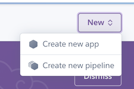
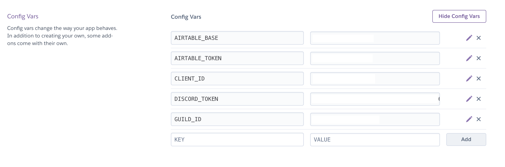
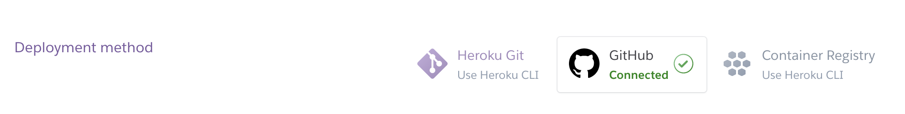
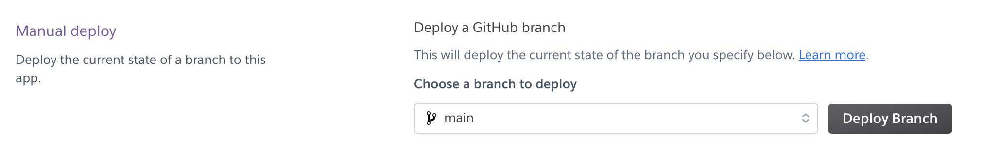
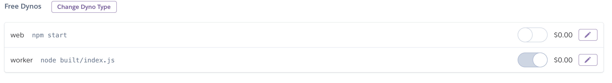
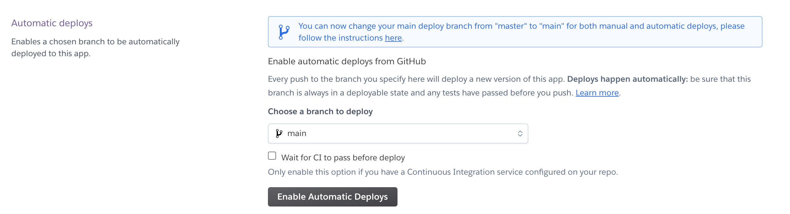

# Heroku

## Setup

Create an account on [heroku](https://heroku.com).
After signing in create a new app.

Select the `Settings` tab and configure the environment variables to connect to your discord bot and server.

Connect the application to the [GitHub](https://github.com) code repository.

Deploy the application manually.

Select the `Resources` tab an configure the dynos to run the `worker` command. Edit the `web` dyno and disable it. Edit the `worker` dyno and enable it.

Configure automatic deployments.

